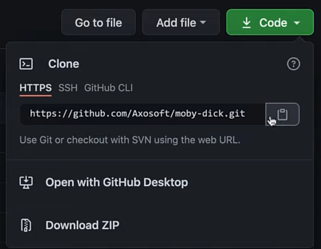

# GitKraken Clone Example Repo
## Featuring Moby Dick

### Hi there and thanks for exploring Git and GitKraken 👋

This repository is meant to provide an example of cloning from GitHub using GitKraken and Git CLI.  

You can follow along with the [video and guide for "What is Git Clone?" on GitKraken.com](https://www.gitkraken.com/learn/git/tutorials/what-is-git-clone?utm_source=learn%20gi[…]20tutorial%20link&utm_campaign=git%20clone%20practice%20repo).

#### Set up:

Before cloning the repo, first fork this GitHub repository.  Forking a repository lets you make a copy of a GitHub repository directly to your GitHub account. 

To fork this repository, click the  button in the upper right of this page. 

**Congratulations!**  

You have successfully forked a repository 🎉

You should now be reading this, and the rest of the instructions, on your own fork!

You will also need to [download GitKraken:](https://www.gitkraken.com/download?utm_source=learn%20git%20practice%20repo&utm_medium=README%20gk%20download%20link&utm_campaign=git%20clone%20practice%20repo)

## Git Clone with GitKraken

1. Click on the "Code" button and copy the URL for the repository.

2. Open GitKraken and click the folder tab in the upper left

3. Under the Clone tab, paste the URL you copied previously.

4. Set the desired folder location for your local copy.  

5. Click "Clone the repo!"

6. After cloning is successful, click the "Open Now" button that will appear in the top banner in GitKraken.

**Congratulations!**  

You have successfully cloned a repository with GitKraken 🎉

*Now, let's try it with the CLI...*

## Git Clone with the Git CLI

1. Open a terminal and let's make sure Git is installed. Type:
`git --version`and if it tells you the version number, then Git is ready to go. If it is not currently installed, [install it from git-scm.com](https://git-scm.com/downloads).

2. Change directory to the target location for your soon-to-be cloned repository. For example, if you wanted to clone it into a directory called `Sites` located under your home directory, you would enter 
  `cd ~/Sites`

3. From your repository on GitHub, click on the "Code" button and copy the URL for the repository.

4. Enter the Git clone command followed by either the SSH or HTTPS URL for the remote repository. 
  `git clone URL-copied-from-step-3`

**Congratulations!**  

You have successfully cloned a repository with the Git CLI.

You can now change directory to the newly cloned repository, in this case, moby-dick, and start editing your files.  
 `cd moby-dick`

## Next Steps

You are now set up to work locally and push your changes to GitHub, or work on GitHub and pull those changes locally. 

[Learn more about pulling and pushing over on GitKraken.com](
https://support.gitkraken.com/working-with-repositories/pushing-and-pulling/)

### Viewing and adding remotes in GitKraken

When using GitKraken, you will see the "Remotes" pane on the left will populate with the name of Remote and its branches. Now you can make your changes and [push them up to your remote](https://gitkraken.com/learn/git/problems/pull-remote-git-branch) so team members can access your updates.

GitKraken also lets you manually add remotes by clicking the plus icon. Here you may paste either the SSH or HTTPS URLs for the repository to add the remote. This is great for adding forks of your project to see what changes team members might be working on. Feel free to add [the original repository](https://github.com/Axosoft/moby-dick) you forked from to see how we evolve this repo in the future. 

### About Moby-Dick

#### *Moby-Dick, or, The Whale* 
##### by Herman Melville. 

It's a book about a giant whale...and so much more.  

The text in this project is written entirely in [Markdown](http://daringfireball.net/projects/markdown/) ([Github flavor](https://help.github.com/articles/github-flavored-markdown)). 

Plain-text source file is `full-text-moby-dick.txt`. Chapters converted to Markdown are in the `/chapters/` directory. 

Based on the [Project Gutenberg](http://www.gutenberg.org/ebooks/2701) [Plain Text UTF-8 file](http://www.gutenberg.org/cache/epub/2701/pg2701.txt).
